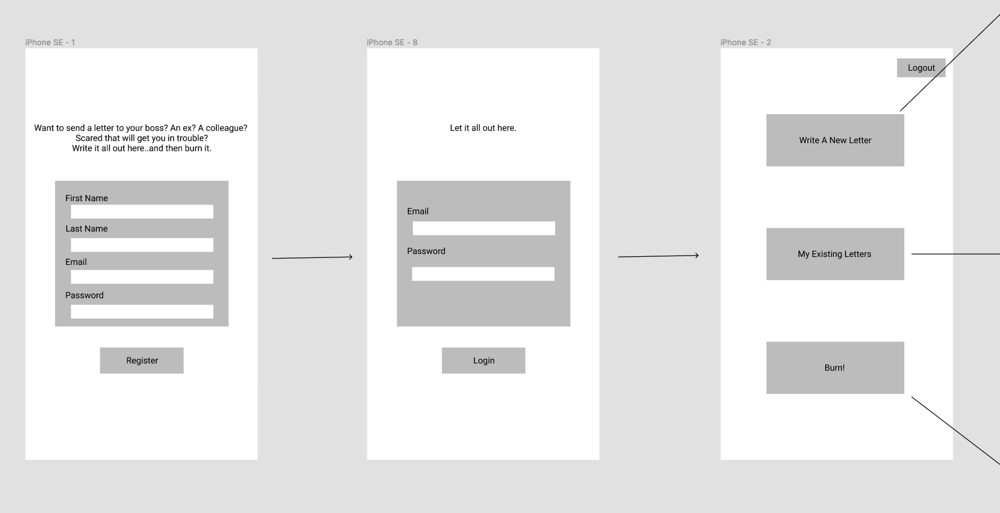
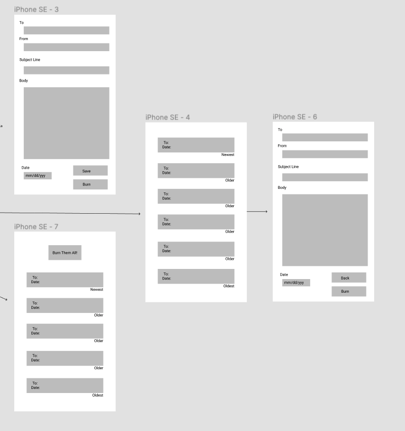

# Letters to Burn

You've always had that letter, email or text you've wanted to send to that one person but just knew you couldn't. It could affect your job, your friendships and your relationships. You

But now, you have "Letters to Burn"! Let it all out here and we can keep it your little secret. You words will not be sent anywhere but it can be used as an outlet to get it all off your chest.

## Motivation

For this project, I wanted to make something that was relatable. When the idea came to me, I had one person in particular that I had so much to say to and knew it would help either one of our situations. So I knew I needed that outlet. Now I want to be able to provide that for others in need.

## User Stories

- As a user, I want to sign up for "Letters to Burn".
- As a logged in user, I want to be able to write my emails/texts/letters in secrecy.
- As a logged in user, I want to be able to re-read, save, or delete my letters.
- As a logged in user, I want to feel better after I hit that "burn" button.

## Technologies Used

For Soul Sip'n we used many different technologies.

- Postgres
- Express
- React
- Node.js
- CSS

## Wireframing / Pre-Code Planning

## Blockers and Unsolved Problems

TBD

## Special Thanks To...

TBD
